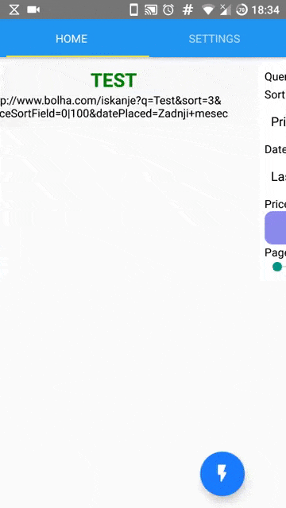

# BolhaJS

[Bolha](http://www.bolha.com/) web scraping using JavaScript. 

## BolhaJS/node

Simple (asynchronous) web scraping using Node.js and cheerio.

## BolhaMobile

Cross platform mobile app using React Native (v0.60.5).



### Build

You will need Node, React Native, etc.
1. Clone the repo and ```cd BolhaMobile```.
2. ```npm install```
3. Open ./android/ using Android Studio and let it sync.
4. Run on device or use a simulator:
    * Debug: 
        1. ```react-native run-android```
        2. ```adb reverse tcp:8081 tcp:8081```
        3. ```adb logcat *:S ReactNative:V ReactNativeJS:V```
    * Release apk building:  
        * ```./gradlew assembleRelease```
        * (TODO use _Hermes_ once it gets fixed for Windows)
